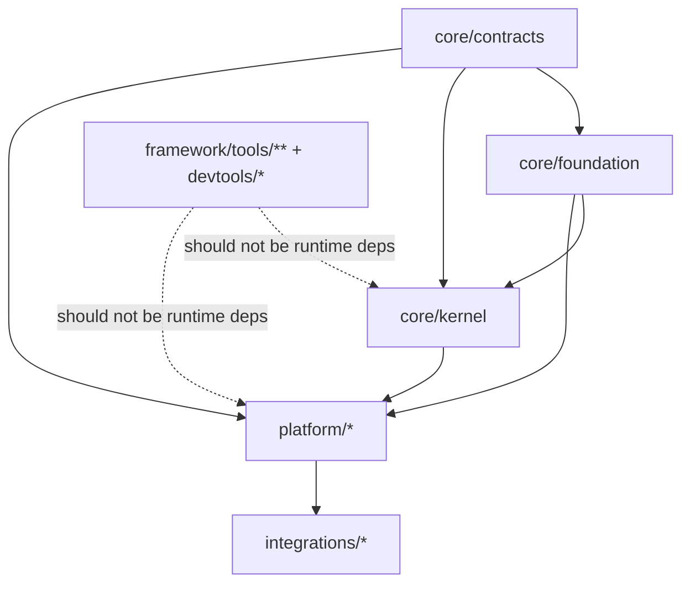

<!--
  Coretsia Framework (Monorepo)
  
  Project: Coretsia Framework (Monorepo)
  Authors: Vladyslav Mudrichenko and contributors
  Copyright (c) 2026 Vladyslav Mudrichenko
  
  SPDX-FileCopyrightText: 2026 Vladyslav Mudrichenko
  SPDX-License-Identifier: Apache-2.0
  
  For contributors list, see git history.
  See LICENSE and NOTICE in the project root for full license information.
-->

# Dependency graph (conceptual)

This document explains **how to think** about dependencies in the Coretsia monorepo.

**Important:** this is a conceptual guide. It MUST NOT be treated as an enforcement statement.  
**Dependency truth (Phase 0 compile-time):** `docs/roadmap/phase0/00_2-dependency-table.md`.

---

## 1) Terms

### Package identity

A package is identified by:

- **path:** `framework/packages/<layer>/<slug>/`
- **package_id:** `<layer>/<slug>`
- **composer name:** `coretsia/<layer>-<slug>`
- **namespace root:** `Coretsia\<Studly(layer)>\<Studly(slug)>\...`

### Dependency types

- **Compile-time dependency:** a Composer requirement needed to build/test/package code.
- **Runtime wiring / discovery:** how modules/providers are discovered and assembled at runtime (policy: metadata-driven, no filesystem scanning).

This doc is about the **graph model**, not the enforcement tooling.

---

## 2) Why a dependency graph exists

The graph exists to guarantee:

- **acyclic architecture** (in practice: no circular compile-time deps),
- **clear layering** (contracts/core/platform/integrations/tooling),
- **deterministic builds** (same inputs → same outputs),
- **stable public surfaces** (boundaries are explicit, not “accidental imports”).

The SSoT dependency table is the only authoritative source for Phase 0 compile-time edges.

---

## 3) Layering intuition (typical, not normative)

A useful mental model:

- **core/contracts**
  - pure ports / value objects; minimal dependencies.
- **core/foundation**
  - primitives and baseline runtime wiring; depends on contracts (and allowed PSR interfaces where explicitly permitted).
- **core/kernel**
  - orchestrates runtime, modules, config/artifacts; depends on contracts + foundation.
- **platform/\***
  - adapters, UX surfaces, integrations glue; generally depends “downward” on core.
- **integrations/\***
  - optional external drivers; typically depends on platform and/or core (but should not pull platform into core).
- **devtools/\*** and `framework/tools/**`
  - tooling and development-time utilities; must not become runtime requirements.

Again: the exact allowed edges live in the dependency SSoT table.

---

## 4) Reading the graph

Think of packages as nodes and compile-time requirements as directed edges:

- edge: `A → B` means “A requires B at compile time”.

Two practical questions to ask for any change:

1) **Does this introduce a new edge?**  
   If yes, it must be reflected (or rejected) by the dependency SSoT.

2) **Does this invert layering?**  
   Example smell: core importing platform types, or tooling leaking into runtime.

---

## 5) Dependency truth: single source of truth

Phase 0 compile-time dependencies MUST be defined only in:

- `docs/roadmap/phase0/00_2-dependency-table.md`

Other docs MAY provide summaries/diagrams, but MUST link to the table and MUST NOT claim it is authoritative.

---

## 6) Runtime discovery is not “dependencies”

A frequent confusion:

- Runtime can **discover** modules/providers via Composer metadata.
- That discovery does **not** change compile-time dependency rules.

Keep the two separate:

- **Dependencies:** what Composer requires to build/run a package.
- **Discovery:** what the runtime finds from installed packages’ metadata.

---

## 7) A small diagram (conceptual)

- Solid arrows: typical compile-time direction (conceptual).
- Dotted arrows: examples of **undesired** direction (tooling → runtime).

The authoritative edges are defined by the dependency SSoT table.

---

## 8) Practical contribution rule-of-thumb

Before you add a `use ...` import across packages, ask:

- Is this a **ports/VO** concern? If yes, it likely belongs in **contracts**.
- Is this a runtime primitive? If yes, it likely belongs in **foundation**.
- Is this orchestration? If yes, it likely belongs in **kernel**.
- Is this a user-facing adapter or integration? If yes, it likely belongs in **platform/integrations**.
- Is this tooling-only? If yes, it must stay under **tools/devtools** and must not become a runtime dependency.
