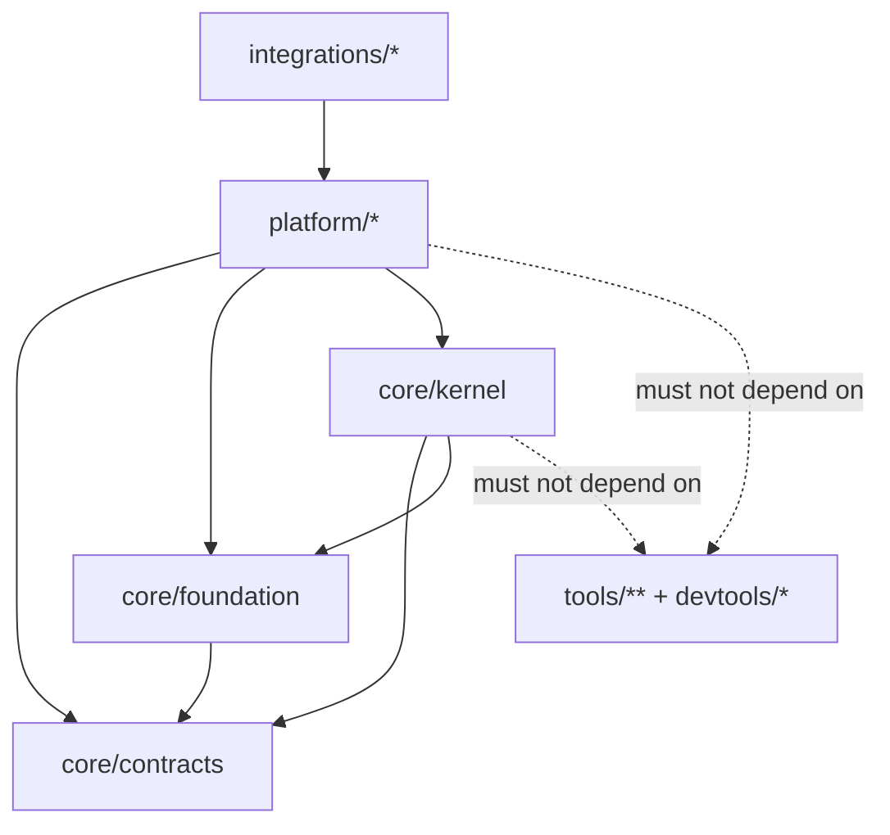

<!--
  Coretsia Framework (Monorepo)

  Project: Coretsia Framework (Monorepo)
  Authors: Vladyslav Mudrichenko and contributors
  Copyright (c) 2026 Vladyslav Mudrichenko

  SPDX-FileCopyrightText: 2026 Vladyslav Mudrichenko
  SPDX-License-Identifier: Apache-2.0

  For contributors list, see git history.
  See LICENSE and NOTICE in the project root for full license information.
-->

# Dependency graph (conceptual)

This document explains how to think about dependencies in the Coretsia monorepo.

Important: this is a conceptual guide. It MUST NOT be treated as an enforcement statement. Exact direct compile-time dependency truth is defined only in `docs/architecture/DEPENDENCIES.md`.

---

## 1) Terms

### Package identity

Publishable Composer products live under `packages/**`.

Layered packages use:

- path: `packages/<layer>/<slug>/`
- package_id: `<layer>/<slug>`
- conventional Composer name: `coretsia/<layer>-<slug>`
- namespace root:
  - `core/*` → `Coretsia\<Studly(slug)>\...`
  - non-core layered packages → `Coretsia\<Studly(layer)>\<Studly(slug)>\...`

Special public distributions are:

- `packages/framework/` → `coretsia/framework`
- `packages/applications/skeleton/` → `coretsia/skeleton`

For every publishable product, the Composer package identity source of truth is the package `composer.json` `name` field. Filesystem layout MUST NOT be used as the universal Composer-name derivation rule.

### Dependency types

- Compile-time dependency: an allowed direct dependency between layered packages; internal production Composer edges declared in `composer.json` `require` must be permitted by `docs/architecture/DEPENDENCIES.md`.
- Runtime wiring / discovery: how modules/providers are discovered and assembled at runtime (policy: metadata-driven, no filesystem scanning).

This doc is about the graph model, not the enforcement tooling.

---

## 2) Why a dependency graph exists

The graph exists to guarantee:

- acyclic architecture (in practice: no circular compile-time deps),
- clear layering across core/platform/integrations/devtools/enterprise/presets, with repository tooling kept outside runtime package dependencies,
- deterministic builds (same inputs → same outputs),
- stable public surfaces (boundaries are explicit, not “accidental imports”).

`docs/architecture/DEPENDENCIES.md` is the only authoritative source for exact direct compile-time package edges.

---

## 3) Layering intuition (typical, not normative)

A useful mental model:

- `core/contracts`
  - pure ports / value objects; minimal dependencies.
- `core/foundation`
  - primitives and baseline runtime wiring; depends on contracts (and allowed PSR interfaces where explicitly permitted).
- `core/kernel`
  - orchestrates runtime, modules, config/artifacts; depends on contracts + foundation.
- `platform/*`
  - adapters, UX surfaces, integrations glue; generally depends “downward” on core.
- `integrations/*`
  - optional external drivers; typically depends on platform and/or core (but should not pull platform into core).
- `devtools/*` and `tools/**`
  - tooling and development-time utilities; must not become runtime requirements.

Again: the exact allowed edges live in the dependency SSoT table.

---

## 4) Reading the graph

Think of packages as nodes and compile-time requirements as directed edges:

- edge: `A → B` means “A MAY directly depend on B at compile time”.

Two practical questions to ask for any change:

1) Does this introduce a new edge? \
   If yes, it must be reflected (or rejected) by the dependency SSoT.

2) Does this invert layering? \
   Example smell: core importing platform types, or tooling leaking into runtime.

---

## 5) Dependency truth: single source of truth

Exact direct compile-time dependency permissions between layered packages MUST be defined only in:

- `docs/architecture/DEPENDENCIES.md`

Other docs MAY provide summaries or diagrams, but MUST refer to that document and MUST NOT introduce alternative package-level edges.

---

## 6) Runtime discovery is not “dependencies”

A frequent confusion:

- Runtime can discover modules/providers via Composer metadata.
- That discovery does NOT change compile-time dependency rules.

Keep the two separate:

- Dependencies: which direct layered-package compile-time edges are architecturally permitted.
- Discovery: what the runtime finds from installed packages’ metadata.

---

## 7) A small diagram (conceptual)

```mermaid
flowchart TB
  Foundation[core/foundation] --> Contracts[core/contracts]

  Kernel[core/kernel] --> Contracts
  Kernel --> Foundation

  Platform[platform/*] --> Contracts
  Platform --> Foundation
  Platform --> Kernel

  Integrations[integrations/*] --> Platform

  Kernel -. must not depend on .-> Tooling[tools/** + devtools/*]
  Platform -. must not depend on .-> Tooling
```

- Solid arrows: typical compile-time direction (conceptual).
- Dotted arrows: examples of undesired dependency direction (runtime → tooling).

The authoritative edges are defined by the dependency SSoT table.

---

## 8) Practical contribution rule-of-thumb

Before you add a `use ...` import across packages, ask:

- Is this a ports/VO concern? If yes, it likely belongs in contracts.
- Is this a runtime primitive? If yes, it likely belongs in foundation.
- Is this orchestration? If yes, it likely belongs in kernel.
- Is this a user-facing adapter or integration? If yes, it likely belongs in platform/integrations.
- Is this tooling-only? If yes, it must stay under `tools/**` or `packages/devtools/**` and must not become a runtime dependency.
